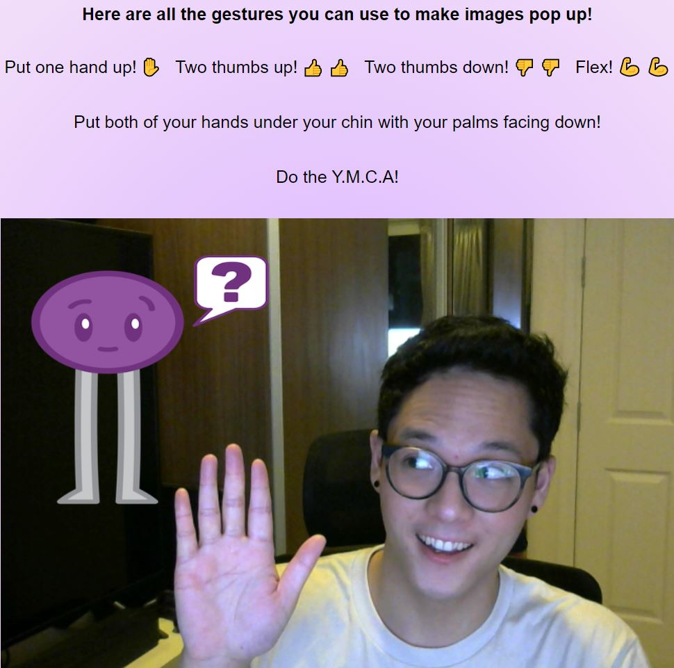

# Geschur

<h1>Table of Content</h1>
<h4><a href="#intro"> 1.Introduction </a></h4>
<h4><a href="#user_guide"> 2.User Guide </a></h4>
<h4><a href="#tech_stack"> 3.Tech Stack </a></h4>
<h4><a href="#contacts">4.Contact Us </a></h4>
<h1 id="intro">Introduction</h1>
This app uses machine learning to read what gestures users are making on their cameras and overlays images ontop of their video feed. Users can also upload their own images for the gestures.

<h1 id="user_guide">User Guide</h1>
Go to geschur.herokuapp.com to see Geschur in action!

## To start the app:

### Run

### `npm install -g live-server`

### Then run 

### `live-server`

Open localhost:8080 to open the app in the browser.
<h1 id="tech_stack">Tech Stack</h1>
Geschur was made using Teachable Machine, ml5.js, and p5.js.

<h6>This was developed during my time as a student at <a href="https://github.com/codechrysalis">Code Chrysalis</a>.</h6>